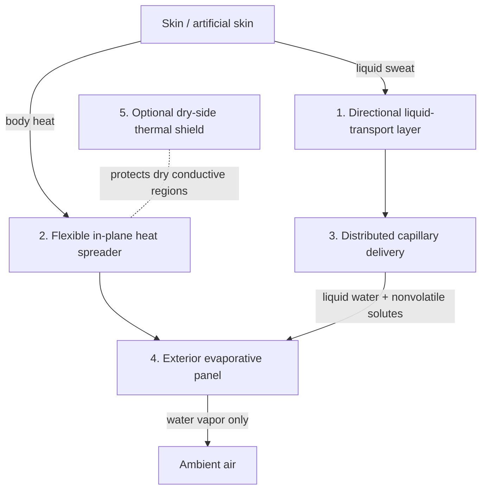
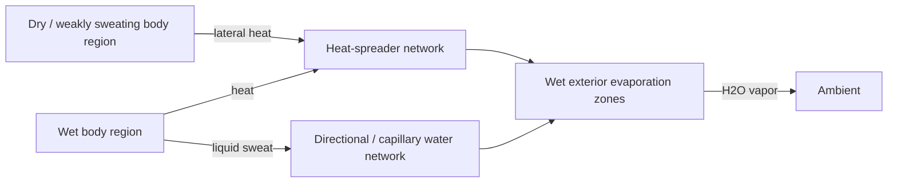
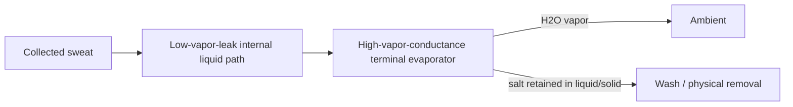

# Numbered System Architecture

Status: schematic / not to scale.

## Figure A1 — primary passive stack

### Layer 1 — directional liquid transport

Purpose: move liquid away from skin and preferentially toward the external side.

Possible implementations:

- wettability-gradient knit/woven/nonwoven textile;
- capillary diode channels;
- hydrophobic inner face + hydrophilic outer transport network;
- asymmetric pore/yarn geometry.

### Layer 2 — flexible heat spreader

Purpose: redistribute body heat laterally toward active evaporation regions.

Possible implementations:

- thin continuous conductive film/sheet;
- anisotropic sheet;
- conductive yarn mesh;
- serpentine traces;
- island-bridge network;
- redundant mesh.

### Layer 3 — liquid distribution network

Purpose: feed exterior evaporators without relying only on the local sweat rate immediately below each evaporator.

Possible implementations:

- capillary yarns;
- porous strips;
- grooves/microchannels;
- stitched or embroidered wicks;
- knit channels.

### Layer 4 — exterior evaporative panel

Purpose: provide wetted exterior area and expose it to ambient heat/mass transfer.

Possible implementations:

- micro-ribs;
- short rounded fins;
- 3D knit;
- patterned pile;
- lamellae;
- low-profile pleats;
- scale-like structures;
- mixed-height/graded-pitch structures.

### Layer 5 — optional dry-side thermal shield

Purpose: reduce parasitic inward heat pickup through dry conductive areas when ambient air is hotter than the skin/garment.

Possible implementations:

- low-conductivity outer layer;
- reflective layer;
- air-gap/spacer textile;
- selective cover that leaves wet evaporators exposed;
- humidity/wetting-responsive exposure.

## Figure A2 — heat and water paths

This figure captures a central reason for using a large-area heat spreader: local evaporation may be spatially nonuniform, while useful body heat is available over a larger area.

## Figure A3 — protected transport / terminal evaporation variant

Salt does not follow the vapor arrow. Under the garment-temperature model, salt vapor flux is zero.

## Figure A4 — apparel integration

The exterior high-area structure may be deliberately made visually indistinguishable from normal technical apparel texture. Functional elements may follow stripes, seams, geometric motifs, shoulder/back panels, or other garment design lines. A visible decorative line may simultaneously act as a thermal-routing path, liquid-routing path, structured evaporation zone, or combination thereof.

## Interpretation

The numbered layers describe functions rather than requiring five physically separable sheets. Multiple functions can be integrated into one textile layer, yarn system, coating, knit structure, or laminate.
